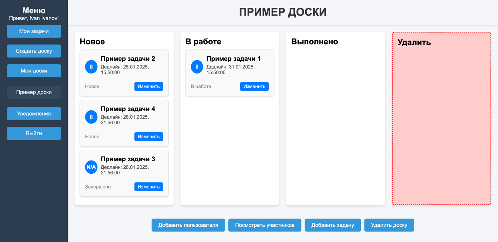
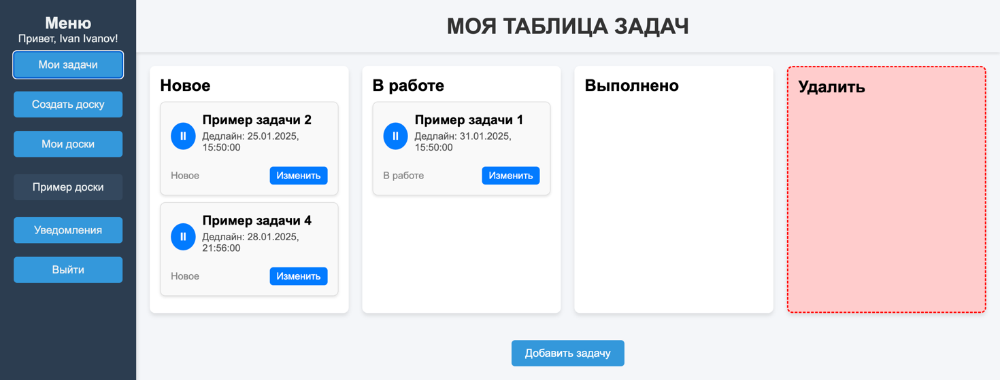

## Создание командных и личных досок для отслеживания задач Spring Boot

### Инструкция по запуску

1. Скопируйте репозиторий командой.
```angular2html
git clone https://github.com/DmitriiLarin/task-tracker
```
2. Создайте файл ```.env``` в корне репозитория и заполните его.
```angular2html
POSTGRES_USERNAME= #YOUR_USERNAME
POSTGRES_PASSWORD= #YOUR_PASSWORD
POSTGRES_URL= #YOUR_URL
JWT_SECRET_KEY= #YOUR_SECRET_KEY
```
3. Запустите приложение с помощью Docker.
```angular2html
docker-compose up --build
```
4. Приложение доступно по адресу.
```angular2html
http://localhost:8080/index.html
```

### Использованные технологии
- Spring Boot
- Postgresql
- Spring Data Jpa
- Docker
- Microservice architecture
- Spring security

### Функционал приложения

- Создание доски
- Получение уведомлений
- Добавление задач, участников на доску

### Демонстрация работы приложения



