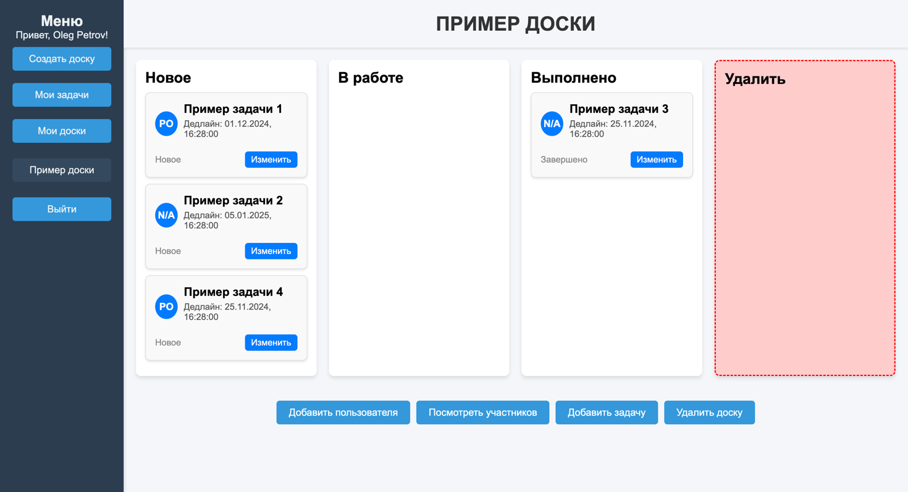
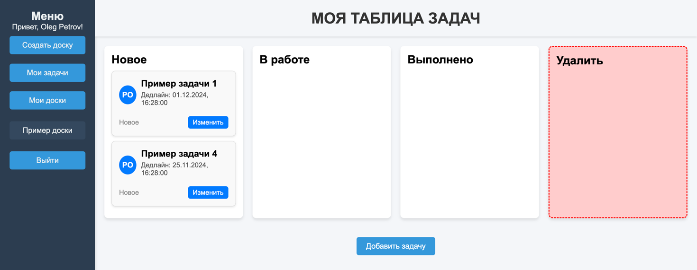

## Создание командных и личных досок для отслеживания задач Spring Boot

### Инструкция по запуску

1. Запустите приложение с помощью docker-compose up --build
2. Приложение доступно по адресу http://localhost:8080/index.html

### Использованные технологии
- Spring Boot
- Postgresql
- Spring Data Jpa
- Docker
- Microservice architecture
- Spring security

### Функционал приложения

- Создание доски
- Добавление задач, участников на доску

### Демонстрация работы приложения

